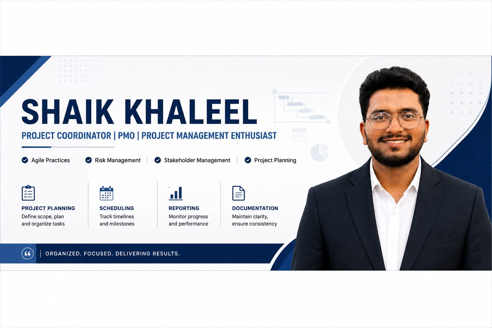

# Hi, I'm Shaik Khaleel 👋

### Project Coordinator | PMO | Project Management Enthusiast

Passionate about project planning, PMO operations, stakeholder communication, documentation, and continuous improvement.

---

## About Me

- 📍 India
- 💼 Aspiring Project Coordinator / PMO Professional
- 📚 Learning Project Management, Agile & Scrum
- 📊 Interested in Dashboards, Documentation & Process Improvement
- 🎯 Goal: Build a career in Project Management

---

## Skills

- Project Coordination
- PMO Documentation
- Microsoft Excel
- Power BI
- Microsoft Office
- Agile Fundamentals
- Jira
- Communication
- Team Collaboration
---

## 💻 Tools

- Microsoft Excel
- Microsoft Project
- Power BI
- Jira
- Trello
- Asana
- Microsoft Office
- Git & GitHub

---

## 📂 Portfolio

### 📁 Project Coordinator Portfolio

- Business Case
- Project Charter
- Stakeholder Register
- Project Reports
- Meeting Minutes
- Dashboards

Repository:

➡️ **Project-Coordinator-Portfolio**

---

## 📜 Currently Learning

- PMP Concepts
- Agile Project Management
- Scrum
- Power BI
- Advanced Excel

---

## 🎯 Career Objective

Seeking opportunities as a **Project Coordinator**, **PMO Analyst**, or **Project Management Associate**, where I can contribute through strong organization, communication, and documentation skills.

---

## 📫 Connect with Me

- LinkedIn - https://www.linkedin.com/in/shaik-khaleel-a066a6236/
- Email - shaikkhaleeljibran@gmail.com

---

### Thanks for visiting my profile!

⭐ Feel free to explore my repositories.

